# GitHub Organization Cloner Wrapper

A fast, concurrent wrapper around the [ghorg](https://github.com/gabrie30/ghorg) CLI tool for cloning multiple GitHub organizations efficiently using functional programming principles.

## Features

- **Unlimited concurrent processing** - Clone multiple organizations with configurable concurrency (no artificial limits)
- **Intelligent batch processing** - Configurable batch sizes with automatic optimization
- **Functional programming architecture** - Pure functions with no side effects in the core logic
- **GitHub PAT support** - Authentication for private repositories
- **Real-time progress tracking** - Structured JSON logging with progress updates
- **Error resilience** - Comprehensive error handling and recovery

## Program Flow Overview

The application follows a **Functional Core, Imperative Shell** architecture with pure functions handling all business logic and side effects isolated to the edges.

### High-Level Flow


### Detailed Program Flow


### Functional Architecture Deep Dive

```mermaid
graph LR
    subgraph "Pure Functions (No Side Effects)"
        PF1[validateConfig]
        PF2[processConfig]
        PF3[createBatches]
        PF4[buildCommand]
        PF5[extractRepoCount]
        PF6[extractRepoName]
        PF7[expandPath]
        PF8[collectAndReportErrors]
    end
    
    subgraph "Function Factories (Return Pure Functions)"
        FF1[CreateEnvConfigLoader]
        FF2[CreateGhorgOrgCloner]
        FF3[createDirectoryPreparer]
        FF4[createCommandExecutor]
        FF5[createOutputCapturer]
        FF6[createProgressReporter]
    end
    
    subgraph "Imperative Shell (Side Effects)"
        IS1[File I/O]
        IS2[Command Execution]
        IS3[Network Calls]
        IS4[Logging]
        IS5[Progress Updates]
    end
    
    FF1 --> IS1
    FF2 --> IS2
    FF3 --> IS1
    FF4 --> IS2
    FF5 --> IS2
    FF6 --> IS4
    
    PF1 --> FF1
    PF2 --> FF2
    PF3 --> FF3
    PF4 --> FF4
    PF5 --> FF5
    PF6 --> FF6
    PF7 --> FF1
    PF8 --> FF6
```



### Concurrency Model


### Error Handling Flow


### Progress Tracking System


## Quick Start

### 1. Prerequisites

Install ghorg CLI tool:

```bash
# Install ghorg - the underlying tool this wrapper uses
go install github.com/gabrie30/ghorg@latest
```

### 2. Build the wrapper

```bash
# Build the functional wrapper
go build -o ghorg-wrapper
```

### 3. Create configuration

Create a `.env` file:

```bash
# Required: Target directory for cloned repositories
GHORG_TARGET_DIR=/tmp/my-repos

# Required: Comma-separated list of GitHub organizations
GHORG_ORGS=hashicorp,kubernetes

# Optional: Concurrency level (default: 1000, no limits)
GHORG_CONCURRENCY=50

# Optional: Batch size (default: 1000, no limits)
GHORG_BATCH_SIZE=10

# Optional: GitHub Personal Access Token
GHORG_GITHUB_TOKEN=ghp_your_token_here
```

### 4. Run the wrapper

```bash
# Execute with configuration file
./ghorg-wrapper .env

# Or with environment variables
GHORG_TARGET_DIR="/tmp/repos" GHORG_ORGS="hashicorp" ./ghorg-wrapper
```

## Configuration Options

| Environment Variable | Required | Default | Description |
|---------------------|----------|---------|-------------|
| `GHORG_TARGET_DIR`   | Yes      | -       | Directory where repositories will be cloned |
| `GHORG_ORGS`         | Yes      | -       | Comma-separated list of GitHub organizations |
| `GHORG_CONCURRENCY`  | No       | 1000    | Number of concurrent clones (unlimited) |
| `GHORG_BATCH_SIZE`   | No       | 1000    | Number of repositories per batch (unlimited) |
| `GHORG_GITHUB_TOKEN` | No       | -       | GitHub Personal Access Token |

## Functional Programming Principles

This codebase strictly follows functional programming principles as defined in `CLAUDE.md`:

### Pure Functions Only
- All core logic implemented as pure functions
- No side effects in business logic
- Deterministic behavior with same inputs
- Immutable data structures

### Function Composition
- Higher-order functions for dependency injection
- Function factories for creating configured functions
- Composable pipeline architecture

### No Imperative Loops
- `map`, `filter`, `reduce` patterns
- Functional iteration over collections
- No mutating loop counters

### Example: Pure Function Pipeline

```go
// Pure function composition
func CreateGhorgOrgCloner() OrgCloner {
    dirPreparer := createDirectoryPreparer()
    cmdExecutor := createCommandExecutor()
    outputCapturer := createOutputCapturer()
    
    return func(ctx context.Context, org, targetDir, token string, concurrency int) error {
        expandedDir, err := dirPreparer(ctx, targetDir)
        if err != nil { return err }
        
        cmd, err := cmdExecutor(ctx, org, expandedDir, token, concurrency)
        if err != nil { return err }
        
        result, err := outputCapturer(ctx, cmd, org, nil)
        if err != nil { return err }
        
        return logCloneCompletion(result, expandedDir)
    }
}
```

## Testing Architecture

Comprehensive testing following TDD methodology:

### Test Types


### Running Tests

```bash
# Run all tests
go test ./... -v

# Run with coverage
go test ./... -cover

# Run specific test patterns
go test -v -run TestWorkflow

# Run race condition tests
go test -race ./...
```

## Performance Characteristics

### Tested Performance
- **hashicorp**: 610 repositories detected and processed
- **kubernetes**: 78 repositories detected and processed  
- **Unlimited concurrency**: No artificial caps on parallel operations
- **Batch optimization**: Intelligent batching based on organization size

### Concurrency Model
- **Worker Pool**: Uses `github.com/panjf2000/ants/v2` for efficient goroutine management
- **Semaphore Control**: Unlimited concurrent batch processing
- **Context Propagation**: Proper cancellation and timeout handling
- **Resource Management**: Automatic cleanup and resource recycling

## Examples

### Clone HashiCorp (610 repos)

```bash
cat > .env << EOF
GHORG_TARGET_DIR=/tmp/hashicorp-repos
GHORG_ORGS=hashicorp
GHORG_CONCURRENCY=50
GHORG_BATCH_SIZE=25
GHORG_GITHUB_TOKEN=ghp_your_token_here
EOF

./ghorg-wrapper .env
```

### High-Performance Setup for Kubernetes

```bash
GHORG_TARGET_DIR="/tmp/k8s-repos" \
GHORG_ORGS="kubernetes" \
GHORG_CONCURRENCY=100 \
GHORG_BATCH_SIZE=50 \
GHORG_GITHUB_TOKEN="ghp_your_token" \
./ghorg-wrapper
```

### Multiple Organizations with Unlimited Concurrency

```bash
GHORG_TARGET_DIR="/tmp/multi-org" \
GHORG_ORGS="hashicorp,kubernetes,docker,prometheus,grafana" \
GHORG_CONCURRENCY=200 \
GHORG_BATCH_SIZE=100 \
./ghorg-wrapper
```

## Build Commands

```bash
# Build application
go build -o ghorg-wrapper

# Run tests
go test ./... -v

# Run with coverage
go test ./... -cover

# Format code
go fmt ./...

# Vet code
go vet ./...

# Run linter
golangci-lint run
```

## Architecture Benefits

### Functional Programming Benefits
1. **Predictable Behavior**: Pure functions with no side effects
2. **Easy Testing**: Functions can be tested in isolation
3. **Composability**: Small functions combine to create complex behavior
4. **Concurrency Safety**: Immutable data prevents race conditions
5. **Maintainability**: Clear separation of concerns

### Performance Benefits
1. **Unlimited Concurrency**: No artificial limits on parallel operations
2. **Efficient Resource Usage**: Worker pools and semaphores manage resources
3. **Intelligent Batching**: Optimal batch sizes for different organization sizes
4. **Context Cancellation**: Proper cleanup and early termination
5. **Structured Logging**: Minimal overhead with structured JSON output

## Development

### Prerequisites
- Go 1.21+
- ghorg CLI tool installed
- GitHub Personal Access Token (for private repos)

### Key Dependencies
- `github.com/panjf2000/ants/v2` - Worker pool management
- `github.com/hashicorp/go-multierror` - Error aggregation
- `golang.org/x/sync/semaphore` - Concurrency control
- `github.com/joho/godotenv` - Environment file loading
- `github.com/stretchr/testify` - Testing framework
- `pgregory.net/rapid` - Property-based testing

### Contributing
1. Follow functional programming principles
2. Write comprehensive tests (Given-When-Then)
3. Maintain pure functions in core logic
4. Use structured logging with `log/slog`
5. Handle all error cases gracefully

This wrapper transforms the single-organization `ghorg` tool into a powerful, concurrent, multi-organization cloning solution while maintaining functional programming principles and providing unlimited scalability.